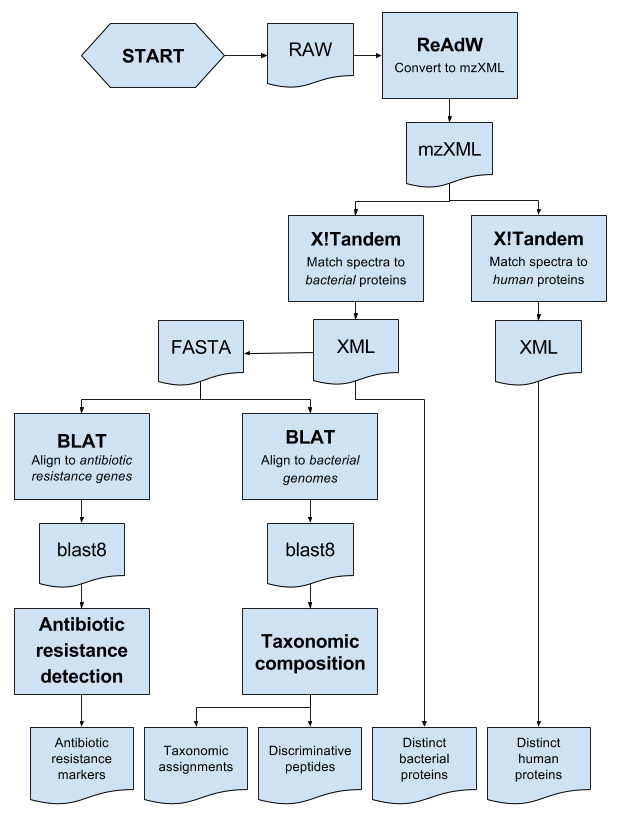

TTT proteotyping pipeline
=========================
This repository contains the components of "The Tailored Treatment
Proteotyping Pipeline", TPARTY, for automated proteotyping analysis of 
samples in `The Tailored Treatment`_ project. 

.. _The Tailored Treatment: http://www.tailored-treatment.eu/

For details on the implementation, please refer to the somewhat
self-documenting Snakemake script, located in the ``Snakemake`` folder of the
repository.

About
*****
:Authors: Fredrik Boulund
:Contact: fredrik.boulund@chalmers.se
:License: ISC

This is the README file for the `TTT Proteotyping Pipeline`, called TPARTY. 
Refer to the `online documentation`_ for instructions on how to use it. 
The code for the project is published as open-source under the ISC license 
and you are welcome to look at, suggest improvements, or download and 
improve/contribute to the code via the project's Bitbucket_ page.

.. _online documentation: http://tparty.readthedocs.org
.. _Bitbucket: https://bitbucket.org/chalmersmathbioinformatics/tparty

Installation
************
Detailed installation instructions are available in the `online
documentation`_. 

Clone the repository to obtain a copy of the code and scripts::

    $ hg clone https://bitbucket.org/chalmersmathbioinformatics/tparty

Dependencies
------------
The pipeline depends on a number of Python packages and external programs, most
notably:

  * ReAdW (raw to mzXML conversion)
  * X!Tandem mass-spectrometry search engine (mzXML to peptides)
  * BLAT (sequence alignment)
  * `TCUP`_

.. _TCUP: https://bitbucket.org/chalmersmathbioinformatics/tcup

Citing
******
If you find the TTT Proteotyping Pipeline useful, please cite us!
The method is described in the following papers:

| Fredrik Boulund, Roger Karlsson, Lucia Gonzales-Siles, Anna Johnning, Nahid Karami, Omar AL-Bayati, Christina Ahren, Edward R. B. Moore, and Erik Kristiansson
| TCUP: Typing and characterization of bacteria using bottom-up tandem mass spectrometry proteomics
| Mol Cell Proteomics mcp.M116.061721. First Published on April 18, 2017, 
| **DOI**:10.1074/mcp.M116.061721
| Keywords: mass spectrometry, proteomics, microbial identification, pathogenic bacteria, antibiotic
resistance detection, LC-MS/MS

and

| Roger Karlsson, Lucia Gonzales-Siles, Fredrik Boulund, Liselott Svensson-Stadler, Susann Skovbjerg, Anders Karlsson, Max Davidson, Stefan Hulth, Erik Kristiansson, Edward R.B. Moore
| Proteotyping: Proteomic characterization, classification and identification of microorganisms – A prospectus
| Systematic and Applied Microbiology, Volume 38, Issue 4, June 2015, Pages 246-257, ISSN 0723-2020
| **DOI**: http://dx.doi.org/10.1016/j.syapm.2015.03.006
| http://www.sciencedirect.com/science/article/pii/S0723202015000491
| Keywords: Proteotyping; Proteomics; Mass spectrometry; Microbial systematics